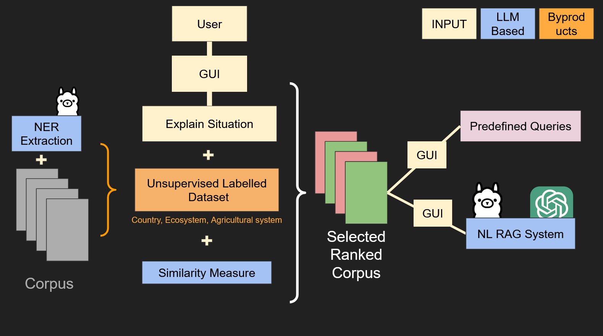

# FarmersGuide: Harnessing Plant-Insect Research for Sustainable Farming

## Overview

FarmersGuide is an innovative project created for the Zif EcoHack LLM Hackathon, where we use Large Language Models (LLMs) to unlock insights from ecological research papers. Our focus is on plant-insect interactions, enabling farmers to make science-backed decisions about crop protection, pollination, and pest management. By transforming complex research into actionable knowledge, FarmersGuide bridges the gap between academic findings and real-world farming solutions.
Problem Statement

Insect-plant interactions play a crucial role in agriculture, from pollination to pest control. However, farmers often struggle to access and interpret the wealth of research in this domain. Scientific papers on plant-insect interactions are often too technical and not readily applicable to farming practices.

FarmersGuide solves this challenge by using LLMs to extract, match, and deliver insights tailored to individual farmers' needs, helping them optimize their agricultural practices while fostering sustainability.

## Core Idea

FarmersGuide specializes in analyzing research papers related to plant-insect interactions to provide farmers with actionable insights.

    - Extract Key Characteristics:
        Crop Information: Identify crops discussed in the papers.
        Insect Interactions: Highlight pollinators, pests, and their behaviors.
        Ecosystem Details: Extract environmental context (e.g., forest, savannah).
        Farming Practices: Analyze methods like organic farming, intercropping, or pest control strategies.

    - Scenario Matching:
        Match the farmer’s situation (crop, location, ecosystem, and challenges) with the most relevant research papers.

    - Natural Language Q&A:
        Use LLMs to answer farmer queries like:
            "What are the best natural pest control methods for tomatoes?"
            "How can I attract pollinators to my organic coffee farm?"

## Key Features

    - Plant-Insect Specialization: Tailored focus on plant-pollinator and plant-pest interactions, making insights highly relevant to farmers.
    - Scenario Matching: Aligns farmer scenarios with ecological research papers for precise recommendations.
    - Natural Language Answers: Provides easy-to-understand, science-based responses.
    - Unsupervised Model: Automatically extracts and organizes information from research papers, requiring no manual labels.
    - Sustainability-Focused: Encourages practices that enhance biodiversity and sustainable agriculture.

## Workflow

    - Research Paper Analysis:
        Input: A collection of plant-insect interaction papers (PDFs or text).
        Output: Extracted metadata (e.g., crop, insect species, interaction type, ecosystem).

    - Embedding Creation:
        Use LLM embeddings to create vector representations of both farmer scenarios and extracted research characteristics.
        Assign higher weights to key fields like crop and insect interactions to prioritize relevant findings.

    - Scenario Matching:
        Compute similarity between farmer inputs and research paper embeddings to rank the most relevant studies.

    - Natural Language Q&A:
        Use LLMs to synthesize data from matched papers and answer farmer questions in an accessible format.

## Tools & Technologies

    - LLM: Ollama LLM or similar for embeddings, Q&A, and text summarization.
    - Document Processing: PyPDFLoader for extracting and splitting text from research papers.
    - Embedding Models: Ollama Embeddings or lightweight alternatives for similarity computations.
    - Vector Stores: ChromaDB for efficient paper retrieval based on farmer scenarios.
    - Frameworks: LangChain for LLM-based pipeline orchestration.

## Impact

FarmersGuide empowers farmers with actionable insights from the latest plant-insect interaction research, helping them:

    - Optimize crop yields through better pollination strategies.
    - Implement sustainable pest management practices.
    - Improve biodiversity on their farms.
    - Access scientific knowledge tailored to their specific needs.

By transforming complex ecological research into practical, real-world solutions, FarmersGuide promotes sustainable agriculture and ecological resilience.
## Future Directions

## Acknowledgment

We are grateful to the Zif EcoHack LLM Hackathon for providing the platform to bring FarmersGuide to life. Together, we’re advancing the intersection of AI, ecology, and agriculture for a sustainable future.
